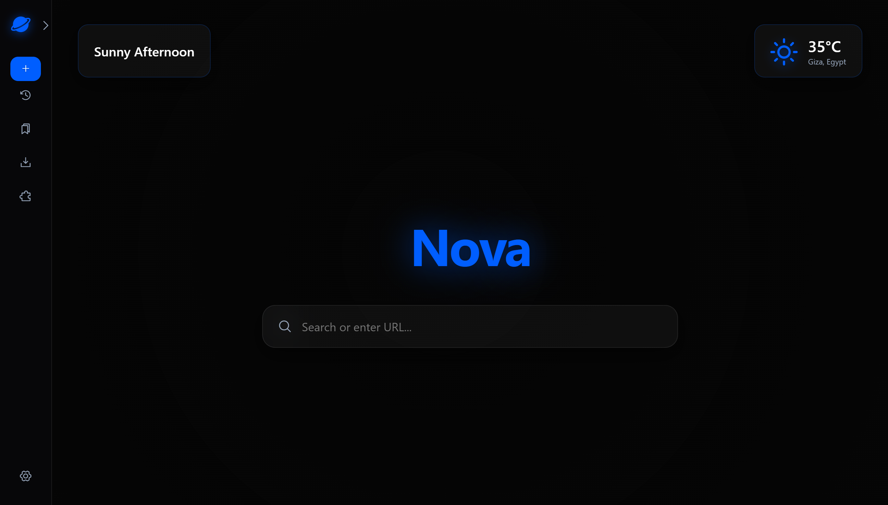
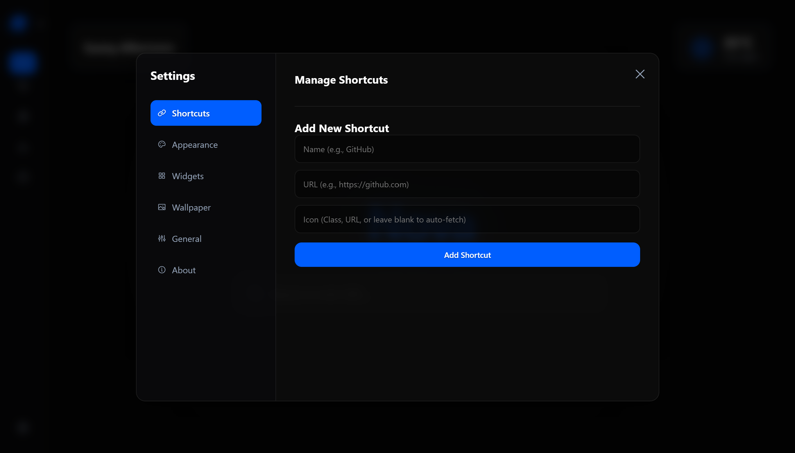

# 🌌 Nova Power Tab (Ultimate Edition)

  
<strong>The ultimate customizable, responsive, and blazing fast glassmorphic new tab experience for Power Users.</strong>

  
   
  

 

## 📸 Screenshots

  
  
  

 

## 🚀 Overview

Nova is not just a new tab page; it's a fully personalized dashboard. Built entirely with **Vanilla JavaScript, HTML, and CSS**, Nova delivers a premium, heavy-duty visual experience—featuring deep glassmorphism, dynamic RGB accent colors, and animated iOS-style UI elements—without the heavy bloat of modern web frameworks. 

Whether you want a dark, moody hacker terminal or a bright, clean productivity space, Nova adapts instantly.

## ✨ Key Features

### 🎨 Deep Personalization & Themes
* **Dynamic Theme Engine:** Seamlessly switch between Dark, Light, or System default modes. Light mode features adaptive contrast to ensure text is always legible.
* **RGB Accent Colors:** Pick any color on the spectrum. Nova's engine converts HEX to RGB on the fly to generate glowing text shadows and perfectly transparent hover states.
* **Full Branding Control:** Change the name of the extension and upload your own logo (or use an icon class) right from the settings.

### 🖼️ Ultimate Wallpaper Engine
* **Upload Your Own:** Upload images straight from your PC. Nova features a built-in Canvas Compression Engine to shrink 4K images down so they never crash your browser's local storage.
* **Daily & Refresh Random:** Automatically fetch stunning landscapes from Unsplash/Picsum daily, or set it to change on every single tab refresh.
* **Cinematic Blur:** Toggle the background blur for a sleek, frosted-glass aesthetic.

### ⚡ Smart Shortcuts Manager
* **Full CRUD Manager:** Add, edit, temporarily disable, or delete shortcuts effortlessly.
* **Universal Icons:** Supports raw URLs (auto-fetches favicons), emojis, or CSS classes from Phosphor, Remix, and FontAwesome. Fallbacks to a sleek letter-icon if nothing is found.

### 🌤️ Live Weather & Smart Greetings
* **Context-Aware Greetings:** Nova says "Good Morning," but if it's raining, it says "Rainy Morning."
* **Pro Weather Dashboard:** Powered by Open-Meteo. Features a built-in city search engine and premium, animated font-based weather icons that adapt to your accent color.

### 🛠️ Anti-Flicker Technology
* Custom synchronous script injection ensures the sidebar and themes load *before* the browser paints the screen. **Zero layout shift. Zero flashing.**

---

## 💻 Installation (Developer Mode)

To run Nova locally on your machine before uploading to the Web Store:

1. Clone or download this repository.
2. Open your Chromium-based browser (Chrome, Edge, Brave, etc.).
3. Navigate to the extensions page: `chrome://extensions/`
4. Toggle **Developer mode** in the top right corner.
5. Click **Load unpacked** and select the folder containing your Nova files.
6. Open a new tab and enjoy!

## 🛠️ Tech Stack
* **Frontend:** Pure HTML5, CSS3 (CSS Variables, Flexbox, Grid), Vanilla JavaScript (ES6+).
* **Storage:** HTML5 `localStorage` (No external database required).
* **APIs:** Open-Meteo (Weather & Geocoding), DuckDuckGo (Search Autocomplete).
* **Icons:** Phosphor Icons, FontAwesome, Remix Icons, Weather-Icons (by Erik Flowers).

## 🔒 Privacy & Permissions
Nova is designed with privacy in mind. Everything is stored locally on your machine.
* `storage`: Used to save your settings, shortcuts, and compressed wallpaper images.
* `tabs`: Used safely to allow the sidebar to open internal browser pages (like History and Downloads).
* `host_permissions`: Explicitly scoped to weather and search APIs to bypass CORS safely.

---

  <i>Built with ❤️ by a Power User, for Power Users.</i>

